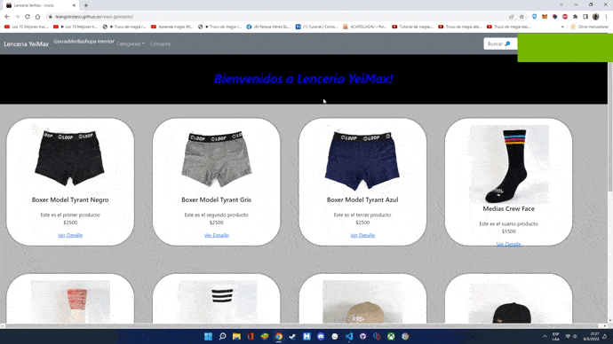

# Lencería YeiMax

## Datos

* **Curso:** React / Coderhouse

* **Comisión:** 31150

* **Profesor:** Medina Diego

* **Tutor:** Ailin

* **Desarrollado por el estudiante:** Leandro Rodrigo Giordano

## Fundamentación

El proyecto surge como propuesta a unos amigos que tienen su emprendimiento de vender lenceria, ropa interior, pijamas y medias. Ofrecí mis servicios de crearles una web a modo estudiantil y der tener buen resultado hacerla 100% operativa.

## Herramientas

### Tecnologías

* **HTML5**
* **CSS3**
* **JavaScript**

### Librerías y frameworks

* **Node.js**
* **React**
* **Bootstrap**
* **MUI**

### Gestor de paquetes

* **npm**

### Control de versiones

* **git**

## Contacto

* **LinkedIn:** https://www.linkedin.com/in/leandrogiordano
* **GitHub:** https://https://github.com/Leangiordano

## En el directorio del proyecto se debe ingresar en la consola:
**npm start**

De esta forma se inicia en forma local y se puede acceder en http://localhost:3000/react-giordano para verlo en el navegador.

Al realizar cualquier modificación en el código, se hará un reload mostrando los cambios.

## Lencería YeiMax Demo

